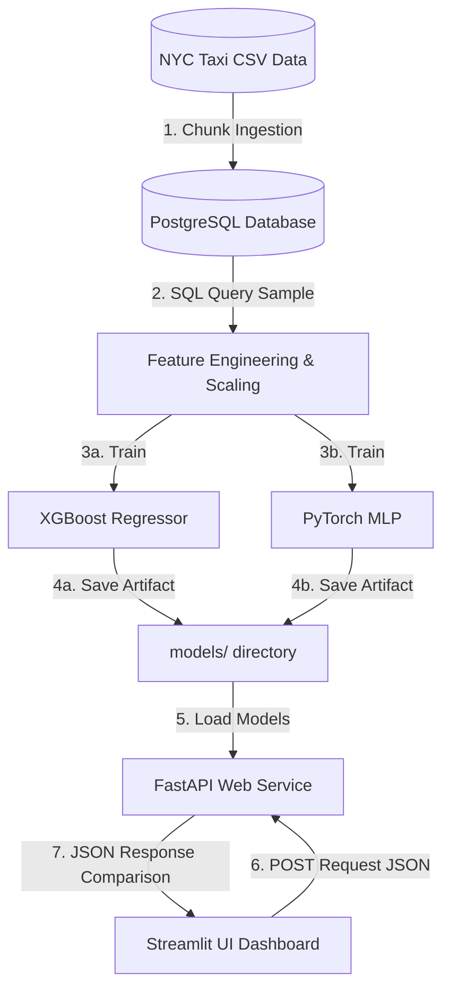

# Panduan Materi Presentasi (PowerPoint): Cara Kerja Sistem End-to-End

File ini dibuat khusus untuk mempermudah Anda memindahkan penjelasan teknis sistem prediksi tarif & durasi taksi NYC ini ke dalam slide presentasi PowerPoint. Setiap bagian mewakili satu slide dengan poin-poin yang ringkas dan padat.

---

### Slide 1: Halaman Judul
*   **Judul:** Sistem Prediksi Multi-Output Tarif & Durasi Perjalanan Taksi NYC
*   **Sub-judul:** Arsitektur End-to-End dari Data Ingestion, Machine Learning, Deep Learning, Hingga Deployment Kontainerisasi
*   **Presenter:** [Nama Anda]

---

### Slide 2: Latar Belakang & Variabel Target
*   **Tujuan Utama:** Mengestimasi dua variabel penting perjalanan taksi secara bersamaan (**Multi-Output Regression**):
    1.  **Harga Akhir (`total_amount`)**: Membantu penumpang mengetahui estimasi biaya.
    2.  **Durasi Perjalanan (`duration_min`)**: Membantu estimasi waktu tempuh secara real-time.
*   **Mengapa Multi-Output?** Durasi perjalanan dan tarif saling berkorelasi erat. Memprediksinya secara bersamaan mempercepat inferensi dibanding menjalankan dua model terpisah.
*   **Karakteristik Data:** Menggunakan dataset historis NYC Yellow Taxi yang bersih dengan fitur spasial (Lokasi Pickup/Dropoff), profil perjalanan (Jumlah Penumpang, Jarak), dan temporal (Hari, Jam).

---

### Slide 3: Arsitektur Sistem End-to-End (Data Flow)
*   **Diagram Alur Data:**

---

### Slide 4: Tahap 1 - Data Ingestion (PostgreSQL)
*   **Tantangan Memori:** Dataset berukuran besar (> 600 MB / Jutaan baris) tidak efisien jika dimuat langsung ke RAM lokal.
*   **Solusi Pipeline:**
    *   Menggunakan script **`db_ingest.py`** untuk membaca data dari CSV secara bertahap (**chunk-by-chunk**) sebesar 100.000 baris sekali jalan.
    *   Melakukan pembersihan dasar saat ingestion (mengisi nilai kosong pada `Airport_fee` & konversi tipe data waktu).
    *   Menyimpan data secara terstruktur ke dalam tabel **PostgreSQL** (`nyc_taxi_trips`) agar siap di-query dengan cepat.

---

### Slide 5: Tahap 2 - Preprocessing & Feature Scaling
*   **Pembersihan Outlier:** Menghapus anomali data (jarak perjalanan > 50 mil, durasi > 120 menit, atau tarif > $200) untuk menjaga kualitas model.
*   **Feature Engineering:**
    *   **One-Hot Encoding:** Mengonversi data kategorikal seperti hari (`day_of_week`) dan kelompok jam sibuk (`hour_bucket`) ke representasi numerik biner (0/1).
    *   **Standard Scaling (Fitur):** Menyamakan skala fitur numerik kontinu (`trip_distance`, `passenger_count`, `pickup_hour`) menggunakan `StandardScaler`.
    *   **Target Scaling (Khusus Deep Learning):** Tarif dan durasi di-scale agar konvergensi *loss function* (MSE) pada PyTorch stabil dan tidak meledak (*exploding gradients*).

---

### Slide 6: Tahap 3 - Pelatihan Model Machine Learning (XGBoost)
*   **Algoritma:** XGBoost Regressor (eXtreme Gradient Boosting).
*   **Keunggulan:** Sangat optimal, tangguh terhadap pencilan, dan menjadi standar industri untuk pemodelan data tabular terstruktur.
*   **Skema Pelatihan:** 
    *   Mendukung multi-output secara langsung.
    *   Dilatih menggunakan hyperparameter optimal (`learning_rate=0.195`, `max_depth=8`).
*   **Evaluasi:** Mengevaluasi kinerja menggunakan metrik **MAE** (tingkat kesalahan rata-rata dalam satuan aslinya) dan **R² Score** (persentase variansi yang berhasil dijelaskan oleh model).
*   **Output:** Model disimpan sebagai `model_ml_best.joblib`.

---

### Slide 7: Tahap 4 - Pelatihan Model Deep Learning (PyTorch MLP)
*   **Arsitektur Neural Network (Multi-Layer Perceptron):**
    *   **Layer Input:** Menerima 17 fitur hasil preprocessing.
    *   **Layer Tersembunyi:** 3 Lapisan Linear penuh (`256 -> 128 -> 64` neuron).
    *   **Batch Normalization:** Disisipkan setelah setiap layer linear untuk menstabilkan distribusi input antar layer dan mempercepat training.
    *   **Dropout (0.2):** Mematikan 20% neuron secara acak saat training untuk mencegah ketergantungan berlebih (*overfitting*).
    *   **Fungsi Aktivasi:** ReLU (Rectified Linear Unit) untuk memperkenalkan sifat non-linear.
    *   **Layer Output:** Mengeluarkan 2 nilai kontinu secara bersamaan (`total_amount`, `duration_min`).
*   **Output:** Bobot model disimpan sebagai `model_dl.pth`.

---

### Slide 8: Tahap 5 - Web API Serving (FastAPI)
*   **Teknologi:** FastAPI (Asynchronous Python Web Framework).
*   **Mengapa FastAPI?** Sangat cepat (kinerja setara Go/NodeJS), mendukung validasi input otomatis dengan `Pydantic`, dan menghasilkan dokumentasi Swagger otomatis.
*   **Cara Kerja Inferensi:**
    1.  Menerima data perjalanan dalam format JSON via request **`POST /predict`**.
    2.  Melakukan prapemrosesan data baru secara instan menggunakan `scaler.joblib` yang disimpan saat training.
    3.  Menjalankan prediksi paralel pada XGBoost dan PyTorch MLP.
    4.  Mengembalikan respons JSON berisi perbandingan estimasi harga dan durasi dari kedua model.

---

### Slide 9: Tahap 6 - Interactive UI Dashboard (Streamlit)
*   **Teknologi:** Streamlit (Python Web App Framework).
*   **Fitur Utama Dashboard:**
    *   **Form Input Interaktif:** Slider jumlah penumpang, input angka jarak perjalanan, dropdown pemilihan lokasi pickup/dropoff, metode pembayaran, dsb.
    *   **Visualisasi Hasil:** Kartu metrik premium yang membandingkan hasil prediksi XGBoost (ML) vs PyTorch MLP (DL) secara berdampingan.
    *   **Status Koneksi:** Indikator sidebar real-time yang menunjukkan apakah API backend aktif atau terputus.

---

### Slide 10: Containerization & Orkestrasi (Docker Compose)
*   **Tujuan:** Memastikan aplikasi berjalan identik di komputer mana pun tanpa konflik dependensi (*"works on my machine" problem*).
*   **Komponen Kontainer:**
    1.  **Container Database (`nyc_taxi_postgres`)**: Menjalankan PostgreSQL Alpine Image untuk menyimpan data perjalanan.
    2.  **Container API (`nyc_taxi_api`)**: Menjalankan FastAPI dengan instalasi Python & PyTorch CPU.
    3.  **Container UI (`nyc_taxi_streamlit`)**: Menjalankan dashboard Streamlit untuk pengguna.
*   **Kemudahan Orkestrasi:** Cukup satu perintah `docker compose up --build`, seluruh jaringan antar container, port forwarding, dan volume data database langsung terkonfigurasi otomatis.
